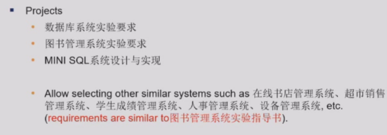
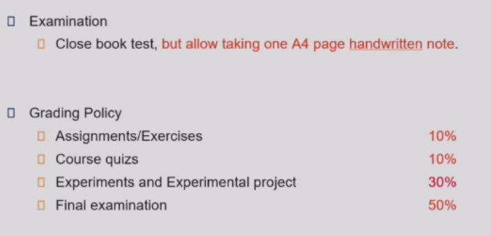

# 数据库系统

!!! abstract
    归档一下2025年学习的课程笔记

## 主要内容
+ Introduction
+ Introduction to Relational Model
+ Introduction to SQL
+ Intermediate SQL
+ Advanced SQL
+ Entity-Relationship Model
+ Relational Database Design
+ Physical Storage System
+ Data Storage Strcture
+ Indexing
+ Query Processing
+ Query Optimization
+ Transactions
+ Concurrency Control
+ Recovery System

## 项目

## 课程评分
+ 每一章留1-2道习题
+ 4-5次课堂测试
+ 可能还有课堂签到？🤐

