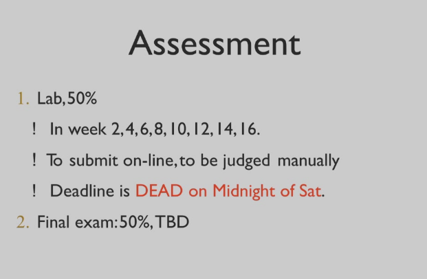

# 面向对象程序与设计

!!! abstract
    归档一下2025年学习的课程笔记

## The development of OOP
+ 第一次软件危机：复杂性
+ 第二次软件危机：可扩展性/可维护性

## 课程内容与目标
+ Introduction to object-oriented programming.
+ ... with a strong software engineering foundation ...
+ producing and maintaining large,high-quality software system.

## 评分要求
