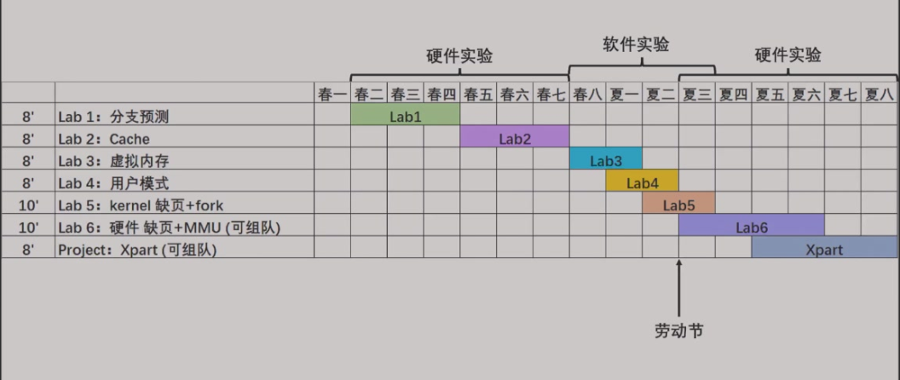
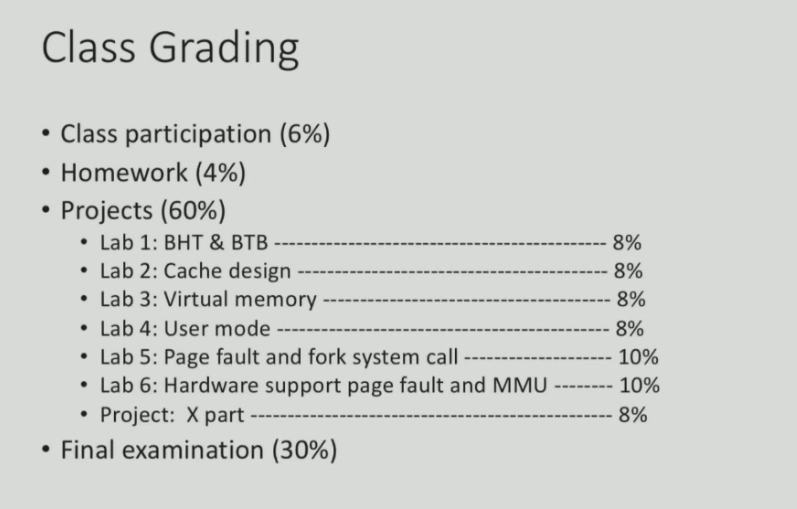

# 计算机系统Ⅲ

!!! abstract
    归档一下2025年学习的课程笔记

## 主要内容
+ Fundamental of computer system
+ ILP
+ Memory Hierarchy(Cache)
+ Memory Hierarchy(Main Memory)
+ File System
+ DLP and TLP
+ Summary

## 实验安排

## 评分要求
+ 据说六分的签到是白送但是有小测？🫠

